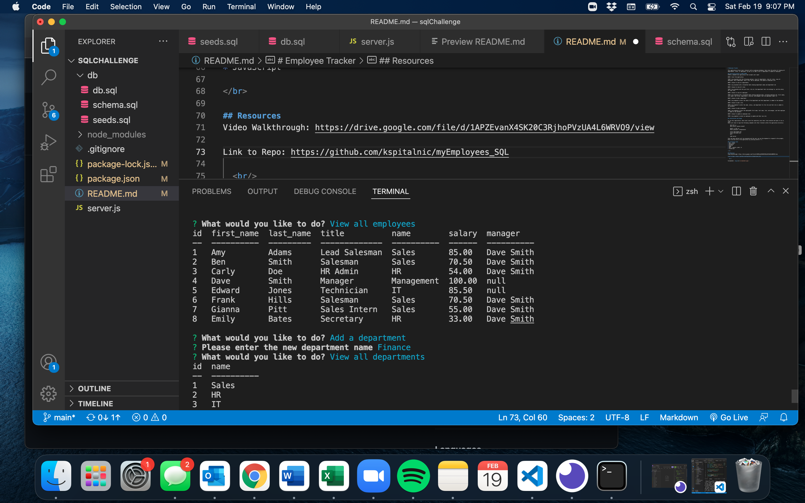

# Employee Tracker

This application allows users interact with an employee database. Users have the option of viewing all departments, roles, or employees. As well as to add a role or department or update an employee. 

## Functioning based on USER STORY
GIVEN a command-line application that accepts user input

WHEN I start the application

THEN I am presented with the following options: view all departments, view all roles, view all employees, add a department, add a role, add an employee, and update an employee role

WHEN I choose to view all departments

THEN I am presented with a formatted table showing department names and department ids

WHEN I choose to view all roles

THEN I am presented with the job title, role id, the department that role belongs to, and the salary for that role

WHEN I choose to view all employees

THEN I am presented with a formatted table showing employee data, including employee ids, first names, last names, job titles, departments, salaries, and managers that the employees report to

WHEN I choose to add a department

THEN I am prompted to enter the name of the department and that department is added to the database

WHEN I choose to add a role

THEN I am prompted to enter the name, salary, and department for the role and that role is added to the database

WHEN I choose to add an employee

THEN I am prompted to enter the employee’s first name, last name, role, and manager, and that employee is added to the database

WHEN I choose to update an employee role

THEN I am prompted to select an employee to update and their new role 

## Installation and Usage 

To use this application. Users must clone the repository onto their local machine and open it via vs code. 
Users will have to type the following commands into their terminal within the application directory: 

    npm init -y
    npm install express mysql2

    mysql -u root -p 
    Enter password: rootpassword

    source db/schema.sql;
    source db/seeds.sql;
    quit 

    node server

Then the menu options will be presented and the user can use the keyboard to respond to the prompts. 
Users can exit out of the application by pressing Control + C. 

## Strategies Used 
* SQL - mysql
* Databases 
* Express
* Node
* NPM - inquire, path, fs
* JavaScript

 

## Resources
Video Walkthrough: https://drive.google.com/file/d/1APZEvanX4SK20C3RjhoPVzUA4L6WRVO9/view

Link to Repo: https://github.com/kspitalnic/myEmployees_SQL

   

Screenshot: 
